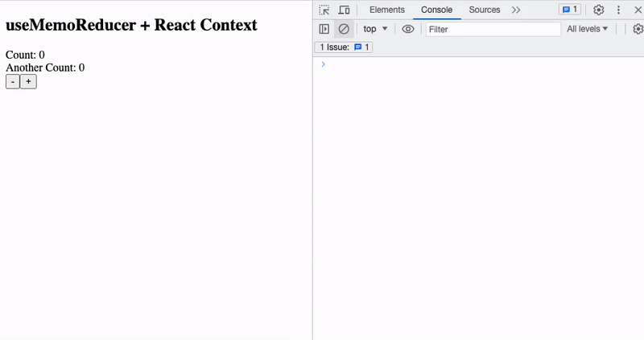

# `useMemoReducer`
**Empowering Selective Rendering**


-brightgreen)
[](https://codecov.io/gh/piskunovim/useMemoReducer)

## Overview

`useMemoReducer` is a React hook engineered to efficiently manage state within a **React Context** by decoupling state updates in your module from the Context's child re-rendering.

Its usage closely mirrors that of `useReducer`, but additionally supports **thunks** and integrates seamlessly with **Redux DevTools** for enhanced debugging.


## Installation

```bash
npm install use-memo-reducer
```

Import:

```javascript
import { useMemoReducer } from 'use-memo-reducer';
```

## Features

✨ **Enhanced Selective Rendering**: increase performance with `useMemoReducer` selective rendering, letting your components render only what's necessary! 🚀

🤝 **Broad React Version Support**: Embrace flexibility with full support for React versions 16, 17, and 18, ensuring seamless integration into any project! 🛠️

💡 **Thunk Support**: Tap into the potency of thunks to manage  synchronous/asynchronous actions. Interact with a store by utilizing the `dispatch` and `getState` methods.  🌟

🔍 **Redux DevTools Integration**: Gain insights into the state flow by integrating `useMemoReducer` with Redux DevTools. Simply assign meaningful names to your connections, and delve into state actions history. 🕵️‍♂️

## Basic Usage

In simple components where performance is not a critical concern, `useMemoReducer` can be employed as a substitute for the conventional `useReducer`. [Specifications](docs/specifications.md).

> However, it brings more to the table by incorporating features like `thunks`, similar to `redux-thunks`, a selector functionality akin to Redux’s `useSelector`, and integration with `Redux DevTools` for effortless debugging in a development environment.

## Advanced Usage

In components where performance is important, the combination of `useMemoReducer` and React’s `Context API` can significantly optimize the rendering process of child components. This is especially advantageous in scenarios where the state updates are frequent or the component tree is substantial.

`useMemoReducer` with a `Сontext API` minimizes and optimizes re-renders through its memoization capabilities. Furthermore, it allows you to use the power of `thunks` for complex logic and asynchronous actions, as well as `selectors` for updated state retrievals.

This approach ensures that only those child components that are actually affected by a state change are re-rendered, instead of the entire component tree. This leads to a more performant and responsive UI, particularly in large-scale applications.

## Example

Let's create a simple application that will use `useMemoReducer` and `Context API`  and will show how child optimised rendering does work. 
    


[](https://codesandbox.io/s/use-memo-reducer-context-example-pcv676?fontsize=14&hidenavigation=1&theme=dark)

Traditionally, React Contexts have had a reputation for being cumbersome when it comes to state storage, mainly due to the challenges in optimizing providers to prevent unnecessary re-renders upon state changes. `useMemoReducer` paves the way for a solution to this issue.

Imagine that we are building a simple counter, and we wish to create a service that allows incrementing and decrementing a value within the state.

```javascript
/* CounterService.jsx */
import React, {
  createContext,
  useContext,
  useCallback,
  useMemo,
  memo,
} from "react";
import { useMemoReducer } from "use-memo-reducer";

export const CounterServiceContext = createContext({});

export const useCounterService = () => useContext(CounterServiceContext);

const counterReducer = (state, action) => {
  switch (action.type) {
    case "increment":
      return { ...state, count: state.count + 1 };
    case "decrement":
      return { ...state, count: state.count - 1 };
    default:
      return state;
  }
};

export const CounterService = memo(({ children }) => {
  const [useSelector, dispatch] = useMemoReducer(counterReducer, { count: 0, anotherCount: 0 });
  
  const increment = useCallback(() => {
    dispatch({ type: "increment" });
  }, [dispatch]);

  const decrement = useCallback(
    () => dispatch({ type: "decrement" }),
    [dispatch]
  );

  const contextValues = useMemo(
    () => ({
      useSelector,
      decrement,
      increment,
    }),
    [decrement, increment, useSelector]
  );

  return (
    <CounterServiceContext.Provider value={contextValues}>
      {children}
    </CounterServiceContext.Provider>
  );
});
```

Notably, the service is memoized to optimize performance by avoiding unnecessary re-renders. `useMemoReducer` seamlessly handles the orchestration of re-rendering processes. All that’s required on your end is to retrieve the `useSelector` from the context hook within the necessary React component, and then pass the selector to it, akin to the familiar workflow with Redux.

```javascript
/* Counter.jsx */
const Counter = () => {
  const { useSelector } = useCounterService();

  const count = useSelector((state) => state.count);
  console.log("render count");

  return <span>Count: {count}</span>;
};

/* AnotherCounter.jsx */
const AnotherCounter = () => {
  const { useSelector } = useCounterService();

  const anotherCount = useSelector((state) => state.anotherCount);
  console.log("render another count");
  
  return <div>Another Count: {anotherCount}</div>;
};

/* ActionButtons.jsx */
const ActionButtons = () => {
  const { decrement, increment } = useCounterService();
  console.log("render action buttons");
  
  return (
    <>
      <button onClick={decrement}>-</button>
      <button onClick={increment}>+</button>
    </>
  );
};
```

Let’s integrate this in the counter component.

```javascript
/* CounterComponent.jsx */
const CounterComponent = () => (
  <CounterService>
    <Counter />
    <AnotherCounter />
    <ActionButtons />
  </CounterService>
);

/* MainComponent.jsx  */
const MainComponent = () => <CounterComponent />;

/* index.js */
createRoot(document.getElementById("app-init")).render(<MainComponent />);
```

What we've achieved here is the creation of a localized store dedicated to a set of components. But what’s even more impressive is the scalability: should you need multiple counters on a single page, simply instantiate this component multiple times. Each counter will maintain its distinct state and independent logic, providing an autonomous ecosystem for each instance.

```javascript
/* MainComponent.jsx  */
const MainComponent = () => (
  <>
    <CounterComponent />
    <CounterComponent />
  </>
);
```

This methodology unlocks boundless possibilities for ingenuity and experimentation in your development process.

## Thunks

When we need to access the current state of our reducer inside an action, such as an increment or decrement function in **CounterService**, it is crucial to do so without causing unnecessary re-renders.

One way to attempt this is by using `useSelector` as shown below:

```javascript
const state = useSelector(state => state);
```

However, this approach is not ideal because it causes the component to re-render every time the state changes, and consequently, all child components subscribed to it will also re-render.

In cases where we need to delay the dispatch of an action, or to dispatch only if certain conditions are met, we need to use `thunks`. 

Here's how we can use a `thunk` to access the current state within an action without triggering unnecessary re-renders:

```javascript
/* thunks.js */
const resetAction = () => (dispatch) => {
  console.log('reset count');
  dispatch({ type: "reset" });
}

export const incrementAction = () => (dispatch, getState) => {
  const { count } = getState();
  
  if (count < 10) {
    return dispatch({ type: "increment" });
  }
  
  return dispatch(resetAction());
}

/* CounterService.js */
const counterReducer = (state, action) => {
  switch (action.type) {
    case "increment":
      return { ...state, count: state.count + 1 };
    case "decrement":
      return { ...state, count: state.count - 1 };
    case "reset":
      return { ...state, count: 0 };
    default:
      return state;
  }
};

export const CounterService = memo(({ children }) => {
  const [useSelector, dispatch] = useMemoReducer(counterReducer, { count: 0, anotherCount: 0 });
  
  const increment = useCallback(() => {
    dispatch(incrementAction());
  }, [dispatch]);

  /* <code_above> */

  return (
    <CounterServiceContext.Provider value={contextValues}>
      {children}
    </CounterServiceContext.Provider>
  );
});
```

[](https://codesandbox.io/s/use-memo-reducer-thunks-example-j6trkr?fontsize=14&hidenavigation=1&module=%2Fsrc%2FCounterComponent%2Fservices%2FCounterService%2FCounterService.jsx&theme=dark)

> It's important to recognize that this example is synthetic and has been engineered specifically to demonstrate the features of the hook.

The main difference is that `thunks` allow us to write action creators that return a function instead of an action. This function can be used to delay the dispatch of an action, or to dispatch only if certain conditions are met.

Within the function, `dispatch` and `getState` are accessible as parameters, which can be used to access the current state without causing re-renders. In the provided example, we expect to reset the counter when the count reaches 10. This is achieved through invoking the `resetAction`thunk from inside of `incrementAction` thunk. Notably, thunks could be **asynchronous**.

## Integration with Redux DevTools

`useMemoReducer` supports integration with Redux DevTools. Make sure you have the Redux DevTools extension installed in your browser. This allows you to inspect the state and actions, which can be incredibly helpful during development.

In order to enable the integration, you need to pass the `devtoolsName` option to the hook in lowercase. This is the name that will be used to identify your store in the Redux DevTools.


```javascript
const [useSelector, dispatch] = useMemoReducer(counterReducer, initialState, {
  devtoolsName: 'counter',
});
```

Currently, this serves as the main debugging tool, but we are considering providing users with alternative debugging options to complement their debugging needs.


## Considerations for Usage

Remember, while this hook introduces a range of optimization and performance capabilities, it is important to keep in mind that the final user of the hook is a developer. Therefore, it is crucial to use this hook judiciously and make informed decisions based on your specific use case.

##  Contributors 👥

<table>
  <tr style='border: none;'>
    <td style="text-align:center;border:none;"><a href="https://github.com/VladimirGr"><br /><sub><b>Vladimir Grigoryev</b></sub></a><br /></td>
    <td style="text-align:center;border:none;"><a href="https://github.com/piskunovim"><br /><sub><b>Igor Piskunov</b></sub></a><br /></td>
  </tr>
</table>

